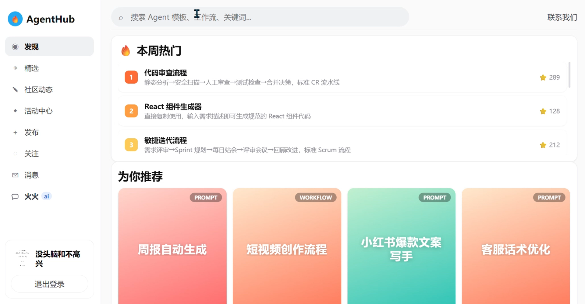

# AgentHub

AI Agent 社区，这个是我开发的面向 AI 使用者的社区，社区会提供Prompt模板，多智能体工作流模板，用户可以浏览评论点赞，社区会不定时推出活动用户可以报名参加，有问题的话用户还可以问AI助手。做这个项目的起因是我身边的人普遍都说好用的prompt模板比较难找，而且找到了也不确定效果好不好，我就想着做一个活跃的社区，大家能够分享自己的使用感受。

## 项目演示

- [演示视频](https://www.bilibili.com/video/BV1QKEq6BEPa/?spm_id_from=333.1387.homepage.video_card.click&vd_source=c51e906c34532a7ccdffd286bee01353)



## 技术栈

- 后端：Java 、Spring Boot、MyBatis Plus、MySQL、Redis、Redisson、Kafka。
- 前端：React 
- AI 服务：Python、LangGraph、LangChain、Milvus。


## 目录结构

```text
Agenthub/
├── src/                         # Java 后端源码
│   ├── main/java/com/agenthub    # controller/service/mapper/entity/config 等模块
│   ├── main/resources            # application.yaml、MyBatis XML
│   └── test/java                 # 后端测试
├── agenthub-web/                 # React + Vite 前端
├── ai-service/                   # FastAPI AI 侧车服务
├── agenthub.sql                  # MySQL 初始化脚本
├── docker-compose.milvus.yml     # Milvus 及依赖服务
├── dev-up.sh                     # 本地 Docker 依赖启动脚本
└── pom.xml                       # Java 后端 Maven 配置
```

## 本地环境要求

- JDK 8+
- Maven
- Node.js 18+ 与 npm
- Python 3.10+
- Docker 与 Docker Compose
- 可用的 Bash 环境，例如 Git Bash、WSL 或 Linux/macOS 终端

## 快速启动

### 1. 启动基础依赖

在项目根目录执行：

```bash
bash dev-up.sh
```

脚本会启动 MySQL、Redis、Kafka、Milvus，并导入 `agenthub.sql`。默认端口如下：

- MySQL: `3306`
- Redis: `6379`
- Kafka: `9092`
- Milvus: `19530`

### 2. 启动 AI 服务

```bash
cd ai-service
python -m venv .venv
source .venv/bin/activate
python -m pip install --upgrade pip
pip install -r requirements.txt
cp .env.example .env
uvicorn app.main:app --host 0.0.0.0 --port 8000
```

本地后端默认运行在 `8002`，建议在 `ai-service/.env` 中设置：

```env
AGENTHUB_JAVA_BASE_URL=http://127.0.0.1:8002
```

如果暂时没有模型 API Key，AI 服务仍可用降级逻辑完成基础联调。

### 3. 启动 Java 后端

```bash
mvn spring-boot:run
```

后端默认端口为 `8002`，主要配置位于 `src/main/resources/application.yaml`。

### 4. 启动前端

```bash
cd agenthub-web
npm install
npm run dev
```

前端默认运行在 `http://127.0.0.1:5173`。Vite 会将 `/api` 和 `/imgs` 代理到后端 `http://127.0.0.1:8002`。

## 关键配置

### Java 后端

配置文件：`src/main/resources/application.yaml`

- `server.port`: 后端端口，默认 `8002`。
- `spring.datasource.url`: MySQL 连接地址，默认数据库 `agenthub`。
- `spring.datasource.username` / `spring.datasource.password`: MySQL 账号密码。
- `spring.redis.host` / `spring.redis.port` / `spring.redis.password`: Redis 连接配置。
- `spring.kafka.*`: Kafka 连接配置。
- `seckill.order.dlt` / `agent.event.dlt`: 消费失败重试后落入死信 Topic，便于排查和补偿。
- `ai.service-url`: Python AI 服务地址，默认 `http://127.0.0.1:8000`。
- `api-key`: 兼容模型服务的 API Key。

### AI 服务

示例配置：`ai-service/.env.example`

- `AGENTHUB_JAVA_BASE_URL`: Java 后端地址。
- `OPENAI_API_KEY`: OpenAI-compatible 模型 API Key。
- `OPENAI_BASE_URL`: 模型服务地址。
- `OPENAI_MODEL`: 对话模型名称。
- `MILVUS_HOST` / `MILVUS_PORT`: Milvus 连接配置。
- `MILVUS_COLLECTION`: Agent 向量集合名。
- `EMBEDDING_MODEL` / `EMBEDDING_DIM`: 向量模型与维度。


## 常用命令

后端：

```bash
mvn test
mvn -DskipTests package
mvn spring-boot:run
```

前端：

```bash
cd agenthub-web
npm run build
npm run preview
```

AI 服务：

```bash
cd ai-service
uvicorn app.main:app --host 0.0.0.0 --port 8000
curl http://127.0.0.1:8000/health
```

## 最后

如果这个项目帮助到了你，可以点点star，谢谢~
